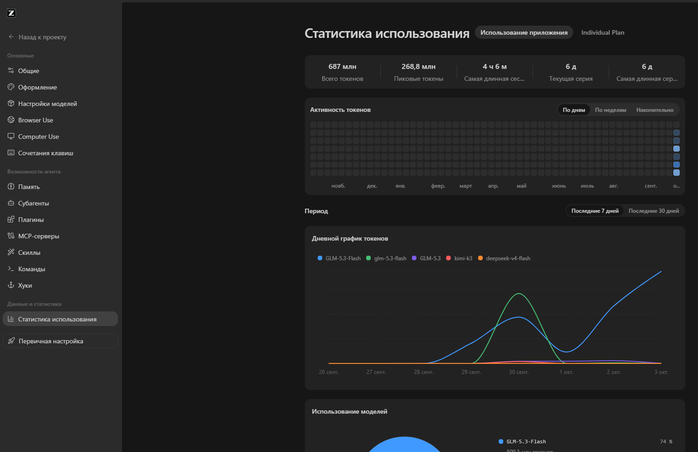

<div align="center">

# 🇷🇺 Русификация ZCode Desktop

### Russian UI localization for ZCode Desktop



**6 013 строк интерфейса · переключатель «Русский» в настройках · патчер с автотестом запуска и автооткатом**

[](https://z.ai)
[](#-русский)
[](translations/ru-RU-catalog.json)
[](LICENSE)

**[🇷🇺 Инструкция на русском](#-русский) · [🇬🇧 English instructions](#-english)**

</div>

---

## 🇷🇺 Русский

### Что это

**ZCode Desktop** (приложение Z.ai для работы с ИИ-агентами) официально
локализован только на английский и китайский. Этот проект добавляет
**русский язык** в интерфейс: меню, настройки, чат, диалоги, статистику —
всё становится русским, а в настройках появляется переключатель языка
с пунктом **«Русский»**.

В приложение уже встроена система локализации (react-intl) — но русского
каталога в ней просто не было. Патчер добавляет каталог из 6 013 переведённых
строк и регистрирует язык `ru` во всех местах, где приложение выбирает язык:
карта локалей, валидаторы, системный определитель, оба выпадающих списка
в настройках и даже экран критической ошибки.

> ✅ Проверено на **ZCode Desktop 3.14.4 (Windows 11)**, октябрь 2026.
> Скриншот выше — реальный интерфейс после установки.

### Требования

| Что | Где взять | Как проверить |
|---|---|---|
| Windows 10/11 | — | на macOS/Linux пути другие, см. «Ограничения» |
| Python 3.8+ | [python.org/downloads](https://www.python.org/downloads/) | `python --version` |
| Node.js 16+ | [nodejs.org](https://nodejs.org/) | `node --version` |
| Git (опционально) | [git-scm.com](https://git-scm.com/) | для `git pull` после обновлений |

Никаких платных инструментов; интернет нужен один раз — чтобы скачался
упаковщик `@electron/asar`.

### Установка за 5 шагов (Windows)

**Шаг 1.** Скачайте репозиторий (зелёная кнопка **Code → Download ZIP**,
или через git):

```cmd
git clone https://github.com/mdn77/zcode-translation-ru.git
cd zcode-translation-ru
```

**Шаг 2.** Соберите патч (найдёт ZCode сам, проверит синтаксис, создаст
резервную копию и подготовит новый файл):

```cmd
python tool\apply_ru_patch.py
```

Вы увидите `syntax OK` у обоих файлов, а в конце — подсказку, что готовый
файл лежит в `resources\app.asar.new-ru`. Пока ZCode запущен, он блокирует
свой файл — это нормально.

**Шаг 3.** Установите патч (скрипт сам закроет ZCode, заменит файл, запустит
приложение и проверит, что окно открылось):

```cmd
tool\install_with_launchtest.cmd
```

Если что-то пойдёт не так — скрипт **сам вернёт оригинал** и перезапустит
ZCode. Отчёт: `C:\Users\<вы>\zcode-swap-result.txt`.

**Шаг 4.** ZCode откроется сам → **Settings → Language → Русский**
(или оставьте «System default» — при русском языке Windows он выберется сам).

**Шаг 5.** Готово. Пользуйтесь на русском 🙂

> Альтернатива шагу 3: закройте ZCode вручную (проверьте трей возле часов!)
> и запустите `python tool\apply_ru_patch.py` ещё раз — на этот раз он заменит
> файл сам. Или используйте `tool\swap_after_close.cmd`, который дождётся
> закрытия приложения.

### После обновления ZCode

Обновление затирает патч (интерфейс снова станет английским). Лечится за минуту:

```cmd
cd zcode-translation-ru
git pull
python tool\apply_ru_patch.py
tool\install_with_launchtest.cmd
```

Патчер ищет нужные файлы **по содержимому, а не по имени** — поэтому обычно
работает и в новых версиях без изменений. Если точка патча всё-таки изменилась,
скрипт честно скажет, что не нашёл, — создайте issue, а до фикса откатитесь
на бэкап.

### Откат на английский

Каждая установка создаёт резервную копию `app.asar.bak-<дата>` в папке
`resources`. Откат (ZCode будет закрыт скриптом автоматически):

```cmd
tool\swap_after_close.cmd "%LOCALAPPDATA%\Programs\ZCode\resources\app.asar.bak-20261003-050152"
```

(подставьте имя своего свежего бэкапа — они сортируются по дате в имени).

### Безопасность установки

Сломать приложение этой утилитой практически невозможно:

1. **Проверка синтаксиса** — оба пропатченных файла прогоняются через
   `node --check` (ESM) до упаковки. Невалидный патч не установится никогда.
2. **Верификация архива** — после пересборки сверяются маркеры патча,
   размер, состав записей и список нативных библиотек.
3. **Резервная копия** — создаётся перед каждой установкой.
4. **Автотест запуска** — после установки скрипт запускает ZCode и ждёт
   35 секунд: нет окна — автоматический откат на оригинал и перезапуск.
5. **Ничего не удаляется** — патч только добавляет русский каталог и
   регистрирует язык; английский и китайский остаются на месте.

### Решение проблем

| Симптом | Причина и решение |
|---|---|
| Патчер пишет `app.asar not found` | Нестандартный путь установки. Укажите явно: `python tool\apply_ru_patch.py --asar "C:\путь\к\resources\app.asar"` |
| Патчер пишет `syntax check FAILED` | Точка патча изменилась в новой версии ZCode. Создайте issue с выводом скрипта |
| `install_with_launchtest` откатил установку | Смотрите причину в `%USERPROFILE%\zcode-swap-result.txt` |
| Пункта «Русский» нет в списке | Работает оригинальный `app.asar` — установка не завершена (ZCode блокировал файл). Запустите `tool\install_with_launchtest.cmd` |
| Антивирус ругается на скрипты | Скрипты полностью открыты: .cmd/.py без сторонних загрузок, всё делает стандартный Python + официальный `@electron/asar` |

### Улучшение перевода

Перевод выполнен автоматически и наверняка местами шероховат:

1. Найдите строку по ключу в `translations/ru-RU-catalog.json`
   (например, `settings.plugins.*` — настройки плагинов).
2. Поправьте, сохраните в UTF-8.
3. Переустановите патч (см. «После обновления ZCode»).

PR с улучшениями очень приветствуются! Исходный английский каталог лежит
рядом (`en-US-catalog.json`), партии перевода — в `translations/batches/`.

### Ограничения

- Патчится только окно приложения; системные диалоги Windows (выбор файла)
  и CLI остаются на английском.
- Экран загрузки и пара служебных HTML-страниц не переведены.
- macOS/Linux: в патчере есть пути для этих ОС, но они не проверялись —
  используйте на свой страх (`python tool/apply_ru_patch.py` сам найдёт
  `/Applications/ZCode.app/...`).

### Как это работает (для любопытных)

Внутри `resources/app.asar` лежит весь интерфейс приложения. Патчер:

1. извлекает архив официальным `@electron/asar`;
2. находит по содержимому два файла: чанк `IntlProvider-*` (каталоги сообщений
   и логика выбора языка) и главный бандл рендерера;
3. добавляет в чанк русский каталог (переменная `__zcodeRuCat`), регистрирует
   `ru` в карте локалей `{"zh-CN":…,"en-US":…,"ru":…}`, валидаторах и системном
   резолвере, добавляет пункт «Русский» в два списка выбора языка;
4. в главном бандле подключает каталог импортом и переводит экран ошибки;
5. проверяет синтаксис обоих файлов через `node --check`, упаковывает архив
   обратно (нативные библиотеки node-pty/ssh2 остаются вне архива, как в
   оригинале), верифицирует и заменяет `app.asar`.

Весь процесс — 2–4 минуты, половина времени уходит на распаковку 27 000 файлов.

---

## 🇬🇧 English

### What is this

**ZCode Desktop** (the Z.ai AI-agent app) officially ships with English and
Chinese UI only. This project adds a **Russian language** option: menus,
settings, chat, dialogs and statistics become Russian, and a **«Русский»**
item appears in the app's language selector.

The app already has a full localization system (react-intl) — it just never
had a Russian catalog. The patcher injects a 6 013-string translated catalog
and registers the `ru` locale everywhere the app picks a language: locale map,
validators, system-locale resolver, both language dropdowns, and even the
crash screen.

> ✅ Battle-tested on **ZCode Desktop 3.14.4 (Windows 11)**, October 2026.
> The screenshot above is the real UI after installation.

### Requirements

- Windows 10/11 (macOS/Linux paths exist in the tool but are untested)
- [Python 3.8+](https://www.python.org/downloads/) — `python --version`
- [Node.js 16+](https://nodejs.org/) — `node --version`

### Install in 5 steps (Windows)

```cmd
git clone https://github.com/mdn77/zcode-translation-ru.git
cd zcode-translation-ru
python tool\apply_ru_patch.py
tool\install_with_launchtest.cmd
```

Then ZCode restarts automatically → **Settings → Language → Русский**. Done.

What each step does:

1. `apply_ru_patch.py` finds your ZCode install automatically, extracts the
   archive with the official `@electron/asar` tool, locates the two JS chunks
   **by content** (so it works across app updates), injects the Russian
   catalog, and **syntax-checks the result with `node --check`** — an invalid
   patch can never be installed. The patched file is staged next to the
   original because running ZCode locks it.
2. `install_with_launchtest.cmd` closes ZCode, swaps the patched file in,
   launches the app and **verifies a window actually appears within 35
   seconds; if not, it automatically reverts to the original** and restarts
   ZCode. No way to brick the app.
3. A timestamped backup `app.asar.bak-<date>` is created before every install.

### After ZCode updates

App updates overwrite the patch (the UI turns English again). Re-apply:

```cmd
cd zcode-translation-ru
git pull
python tool\apply_ru_patch.py
tool\install_with_launchtest.cmd
```

### Rollback

```cmd
tool\swap_after_close.cmd "%LOCALAPPDATA%\Programs\ZCode\resources\app.asar.bak-YYYYMMDD-HHMMSS"
```

Use the newest `.bak-…` file in the resources folder.

### Troubleshooting

| Symptom | Fix |
|---|---|
| `app.asar not found` | Pass the path explicitly: `python tool\apply_ru_patch.py --asar "C:\path\to\resources\app.asar"` |
| `syntax check FAILED` | The patch point changed in a newer ZCode — please open an issue with the script output |
| Install was auto-reverted | See `%USERPROFILE%\zcode-swap-result.txt` for the reason |
| No «Русский» in the list | The original archive is still active — the final swap never happened; run `tool\install_with_launchtest.cmd` |

### Repo layout

```
tool/apply_ru_patch.py              the patcher (Python + official @electron/asar)
tool/install_with_launchtest.cmd    install + launch test + auto-rollback
tool/swap_after_close.cmd           plain file swap helper
translations/ru-RU-catalog.json     Russian catalog, 6 013 strings
translations/en-US-catalog.json     original English catalog (reference)
translations/batches/*.json         per-batch translations (for improvements)
docs/screenshot-ru.png              real UI screenshot
```

### Notes

- Only the app window is localized; native OS file dialogs and the CLI stay
  English.
- The translation was produced automatically — polishing PRs are very welcome.
- Not affiliated with Z.ai. Use at your own risk; the tool creates backups
  and never deletes anything.

---

<div align="center">

**Лицензия / License:** MIT — [LICENSE](LICENSE)

</div>
